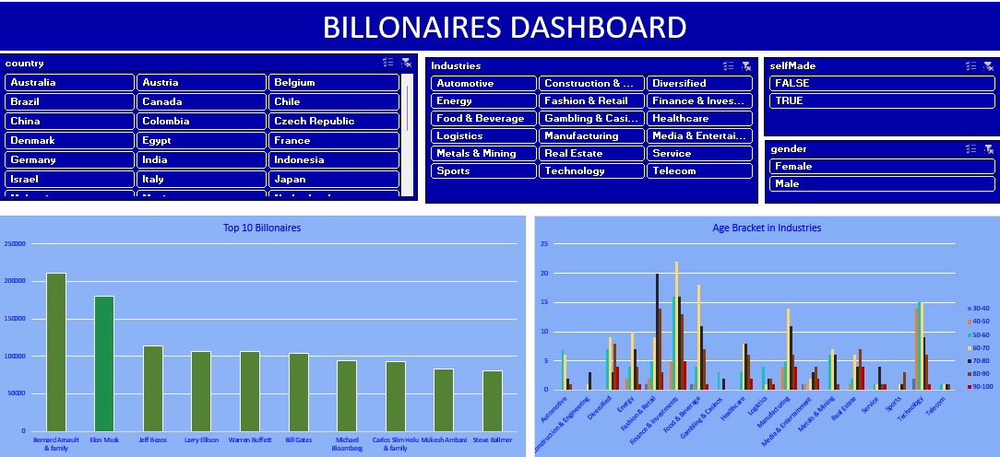
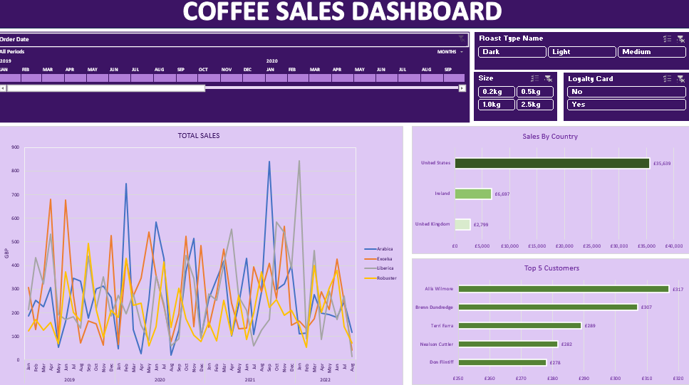

# Project 1

**Tittle:** [Billionaires Dashboard (1).xlsx](https://github.com/Kerristech/Ar.mar.rah/blob/main/Billionaires%20Dashboard%20(1).xlsx)

**Tools Used:** Microsoft Excel (Pivot chart, pivot tables,conditionalfomatting, filters,)

**Project Description:** In order to identify patterns and trends in the distribution of wealth across different industries and populations, this research examines a dataset of billionaires from across the world. I investigated the wealth, origins, age ranges, and industry affiliations of billionaires using Excel pivot tables and slicers. The objective was to comprehend the ways in which wealth is influenced by industry, gender, country, and self-made status. Through interactive slicers, age distribution analysis across industries, and a visualisation of the top 10 wealthiest people, the dashboard provides a clear and captivating picture of the billionaire landscape.

**Key Findings:** The wealthiest people are concentrated in particular sectors, including finance and technology, and are heavily represented by nations like China and the United States. Both self-made and inherited billionaires are listed in the top rankings, indicating a pronounced difference in the sources of wealth. Age Distribution by Sector: The average age of billionaires is higher in some areas, and they are older. like manufacturing and real estate, and lower in others, like media and technology. This age distribution demonstrates how different industries draw leaders and entrepreneurs at different phases of their lives. Slicer-based demographic insights: Gender: Most businesses are dominated by male billionaires, while more balanced gender representation can be found in industries like fashion and retail.

**Dashboard Overview:** The dashboard's interactive tables and infographics make it simple for visitors to see how billionaires' money is distributed. Important components consist of: The Top 10 Billionaires Table lists the names, nations, sectors, and self-made status of the top ten people in terms of their ultimate value. Analysis of the Age Bracket by Industry: The age distribution across industries is displayed in a bar or line chart, which makes it easier for users to spot age patterns in each industry. Interactive Slicers: Users can dynamically filter data using the slicers (Gender, Country, Self-Made Status, and Industry). Users can examine customised insights by choosing particular slicer choices, such as examining industry-specific trends or concentrating just on female self-made billionaires in a given nation.Country and Industry Breakdown: A graphic depiction of wealth distribution by nation and industry that shows the locations of billionaires and the wealthiest industries.

# Project 2

**Tittle:** [Coffee sales dashboard.xlsx](https://github.com/Kerristech/Ar.mar.rah#:~:text=Coffee%20sales%20dashboard.xlsx)

**Tools Used:** Microsoft Excel (pivot chart, pivot table, conditional formatting, filters,Slicer, Timeline)

**Project Description:**In order to get knowledge about sales performance, consumer preferences, and geographical demand trends, this project entailed a thorough examination of a coffee sales dataset. In order to analyse seasonality and year-over-year increase, key indicators were calculated, such as total sales by year with a breakdown by month. High-performing areas were identified by further segmenting sales by nation, and customer value and loyalty patterns were shown by analysing the top five customers.

**key findings:** The analysis's main conclusions showed that buyers preferred the Medium roast in the 2.5 kg size the most, indicating a significant demand for bigger amounts of this specific roast kind. Interestingly, a sizable percentage of these transactions were made by return, devoted customers who used loyalty cards, suggesting that the Medium 2.5 kilogramme choice was highly preferred. Furthermore, sales statistics varied significantly from month to month, with some months showing strong sales numbers and others seeing little to no sales. 

**Dashboard Overview:** With slicers for roast type (Dark, Light, and Medium) and coffee size (0.2kg, 0.5kg, 1.0kg, and 2.5kg), users may filter data based on key product qualities. The dashboard is made for interaction and in-depth study. Additionally, a date timeline allows users to examine order patterns throughout all time periods, and a loyalty status slicer (Yes or No) aids in distinguishing between loyal and one-time customers. By emphasising both high-level trends and specifics in sales data, this extensive dashboard facilitates strategic decision-making and provides an easy-to-use interface for rapidly visualising important information.

